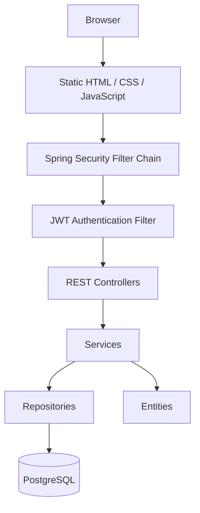

# Stouchi — Personal Budget Tracker

> **Note:** This README is an expanded version of the original project documentation,
covering the application's architecture, authentication flow, security, development workflow,
and future improvements.

## Description

Stouchi is a personal budget management web application that allows users to:

- Register and securely authenticate
- Manage income and expense transactions
- Organize transactions into categories
- Define monthly budgets
- Track balances and spending

The project also serves as a practical learning project for Spring Boot, Spring Security, JWT authentication, Docker, PostgreSQL, and DevOps, including Terraform, Ansible, GitHub Actions, GHCR, and Microsoft Azure.


## Original Project

This project is forked from https://github.com/badis99/Projet-AR.git

The original project provided the core budget management features. This fork extends it with Spring Security, JWT authentication, user-specific data isolation, Dockerized PostgreSQL, and DevOps improvements.

---

# Repository File Architecture

```text
Stouchi/
│
├── .github/
│   └── workflows/
│       └── ci_cd.yml
│
├── ansible/
│   ├── playbook.yml
│   ├── inventory.yml
│   ├── group_vars/
│       └── stouchi-prod-server/
│           └── vault.yml
│  
├── terraform/
│   ├── azure/
│   │   ├── backend.tf
│   │   ├── providers.tf
│   │   ├── main.tf
│   │   └── output.tf
│   │
│   └── bootstrap/
│       ├── main.tf
│       └── providers.tf
│
├── scripts/
│   └── (developer/operator helper scripts: to add later)
│
├── src/
│   ├── main/
│   │   ├── java/
│   │   └── resources/
│   └── test/
│       └── java/
│       └── resources/
│
├── Dockerfile
├── docker-compose.yml
├── docker-compose.prod.yml
├── .dockerignore
├── .env.example
├── .gitignore
├── pom.xml
├── requests.http
└── README.md
```

The main separation is:

```text
Application code
    └── src/

CI/CD automation
    └── .github/workflows/

Server configuration and deployment
    └── ansible/

Infrastructure as Code
    └── terraform/

Operational helper scripts
    └── scripts/
```

The `terraform/bootstrap/` configuration is kept separate from
`terraform/azure/` because the bootstrap creates the remote Terraform
state infrastructure used by the main Azure configuration.

---

# Architecture



Authentication happens **before** any controller is executed.

## Functional Areas

- Authentication
- Categories
- Transactions
- Monthly Budget

Entities:

- User
- Category
- Transaction
- MonthlyType
- TransactionType

---

# Tech Stack

- Java 17
- Maven
- PostgreSQL 16
- Docker & Docker Compose

Spring Boot:

- Spring Web
- Spring Data JPA
- Spring Security
- JWT Authentication

---

# Running the Application

## Docker

```bash
cp .env.example .env
docker compose up --build
```

Subsequent runs:

```bash
docker compose up
```

Stop:

```bash
docker compose stop
```

Remove containers:

```bash
docker compose down
```

Remove everything including database:

```bash
docker compose down -v
```

---

## Local Development

Run PostgreSQL inside Docker:

```bash
docker compose up postgres
```

Build once (or after dependency changes):
```bash
mvn clean install
```
Start Spring Boot:
```bash
mvn spring-boot:run
```

During development with Spring Boot DevTools, most Java changes only require:
```bash
mvn compile
```
Refresh the browser after DevTools restarts the application. Use `mvn clean install` again only when dependencies change, you need a full build, or want to recreate the JAR.

Advantages:

- Instant restart
- DevTools support
- Easier debugging
- Breakpoints
- No Docker rebuild after every Java change

---

# API Overview

The application exposes two categories of endpoints.

## Authentication Endpoints (`/auth`)

| Method | Endpoint |
|---------|----------|
| POST | /auth/register |
| POST | /auth/login |

These endpoints are accessible without authentication.

---

## Application Endpoints (`/api`)

All endpoints below require a valid JWT.

| Resource | Endpoints |
|----------|-----------|
| Categories | /api/categories |
| Transactions | /api/transactions |
| Budget | /api/budget |

---

# Authentication

Authentication uses JWT.

Workflow:

```text
Register
    ↓
Login
    ↓
JWT generated
    ↓
Browser stores token
    ↓
Future requests include:

Authorization: Bearer <token>
```

The application is **stateless**.

No HTTP session is stored on the server.

---

# Security Filter Chain

Every request follows this path:

```text
HTTP Request
        │
        ▼
Spring Security Filter Chain
        │
        ▼
JwtAuthenticationFilter
        │
        ▼
JWTService
        │
        ▼
SecurityContext
        │
        ▼
Controller
```

The controller never validates the JWT itself.

Instead, Spring Security authenticates the request before any controller executes.

---

# SecurityContext

After validation, the JWT is no longer used directly.

Instead:

- Spring Security creates an authenticated user
- Stores it inside the SecurityContext
- Controllers and services use Spring Security rather than parsing tokens

---

# SecurityConfig

Configuration responsibilities:

- Disable CSRF
- Use stateless sessions
- Permit public pages and static resources:
  - `/register.html`
  - `/login.html`
  - `/index.html`
  - `/js/**`
  - `/css/**`
  - `/auth/register`
  - `/auth/login`
- Register `JwtAuthenticationFilter`
- Protect every other endpoint through:

```java
.anyRequest().authenticated()
```

Every request not explicitly permitted requires a valid JWT before reaching a controller.

---

# User-specific Data

Originally, data was shared.

Now every:

- Category
- Transaction
- MonthlyBudget

belongs to one User through a `user_id`.

Default categories are created after registration instead of application startup.

---

# DTOs

The application exchanges DTOs instead of entities.

Examples:

- RegisterRequest
- LoginRequest
- AuthResponse

Passwords are never returned to clients.

---

# Lombok

Lombok generates:

- Constructors
- Getters
- Setters
- equals()
- hashCode()

keeping entity classes concise.

---

# Static Resources

The browser separately requests:

- HTML
- CSS
- JavaScript
- Images

Therefore Spring Security must permit these resources, otherwise pages load with HTTP 403 or incomplete assets.

---

# Controllers

Controllers expose HTTP endpoints only.

Requests may come from:

- JavaScript
- REST Client
- Postman
- Mobile application

Controllers never know the client.

---

# Frontend Security

Redirects such as

```javascript
window.location.href="/index.html";
```

do **not** protect the application.

Only backend authorization enforced by Spring Security secures protected resources.

---

# HTTP Request Workflow

```text
Browser
   │
JavaScript
   │
fetch()
   │
HTTP Request
   │
Spring Security Filter Chain
   │
JWT Filter
   │
SecurityContext
   │
Controller
   │
Service
   │
Repository
   │
PostgreSQL
   │
JSON Response
   │
JavaScript
   │
DOM Update
```

---

# DevOps Notes

- Multi-stage Docker build
- Layer caching
- PostgreSQL persistent volume
- `.env` secrets
- Hibernate `ddl-auto=update`
- Health checks
- Container dependency ordering
- Tests skipped during Docker image build (`-DskipTests`)

---

# Testing

## Overview

In a DevOps CI/CD pipeline, automated tests serve as a critical quality gate before deployment. They catch regressions early and ensure code reliability. This project includes both unit tests and integration tests to validate business logic and full application workflows.

The project tests live under `./src/test/java/com/budgettracker`.

### Test Types in This Project

This project uses two main testing approaches:

**Unit Tests:**
- `BudgetServiceTest.java` — validates budget status calculations for scenarios like no budget, below-limit usage, reaching 100%, and exceeding the budget
- `UserServiceTest.java` — validates login behavior for invalid username, wrong password, and successful authentication

**Integration Tests:**
- `AuthenticationIntegrationTest.java` — exercises the real authentication flow with MockMvc, Spring Boot, and Testcontainers against a PostgreSQL test container

---

## Security Debug Logging

If you want better visibility while debugging security-related issues, enable:

```properties
logging.level.org.springframework.security=DEBUG
```

in `src/main/resources/application.properties`.

This helps you see:

- Which security filter is processing the request
- Whether authentication succeeded or failed
- Which URL matcher was applied
- Why a request was rejected
- Whether you received 401 or 403

---

## Error Handling and Protected `/error` Endpoint

If the `/error` page is protected, a confusing situation can occur:

**Original error:**

```
500 Internal Server Error
```

**What you see instead:**

```
403 Forbidden
```

because Spring Security blocked the error page before the real error could be displayed.

A common fix is to allow it explicitly in `SecurityConfig`:

```java
.requestMatchers("/error").permitAll()
```

This prevents Spring Security from hiding the real root cause behind a security block, making debugging much easier.

---

## Test Structure: Arrange, Act, Assert

Both unit tests and integration tests follow the same logical structure:

**Unit Test Example:**

```
Arrange: create mocks, set up when(...).thenReturn(...)
   ↓
Act: call the method under test
   ↓
Assert: verify result using assertEquals(), assertTrue(), assertThrow()
```

**Integration Test Example:**

```
Arrange: prepare test data using repositories/services (NOT HTTP requests)
   ↓
Act: perform HTTP request via MockMvc
   ↓
Assert: verify HTTP status, response body, and database state
```

For integration test example:

```java
@Test
void shouldNotRegisterDuplicateUser() throws Exception
{
    // Arrange: create and persist test data via repository
    User existingUser = new User();
    existingUser.setUsername("anais");
    userRepository.save(existingUser);

    String requestBody = """
    {
        "name": "Anais",
        "lastname": "Watterson",
        "username": "anais",
        "password": "meaw123"
    }
    """;

    // Act: perform HTTP request
    ResultActions res = mockMvc.perform(post("/auth/register")
        .contentType(MediaType.APPLICATION_JSON)
        .content(requestBody));

    // Assert: verify response and database state
    res.andExpect(status().isConflict());
    res.andExpect(content().string("Username already exists"));
    assertEquals(1, userRepository.count());
}
```

### Test Naming Convention

Use a descriptive naming style:

```
methodName_condition_expectedResult
```

Example:

```java
void getBudgetStatus_whenNoBudgetExists_returnsStatusWithoutBudget()
```

This makes test purpose immediately clear.

---

## Test Isolation

Each test describes one scenario and runs independently. Test isolation is critical for both unit and integration tests.

**Unit Tests:** Create fresh mock objects for every test method. If the "warning" test fails, you know it failed because of the warning logic, not because another test changed the mock behavior.

**Integration Tests:** Each test must independently prepare its own data using repository operations in `@BeforeEach` setup. JUnit does not guarantee execution order, so dependencies between tests create brittleness. Instead, each test independently sets up the data it needs via the repository.

---

## Unit Testing

### Unit Test Assertions

Unit tests verify behavior using standard JUnit assertions:

```java
assertEquals(expected, actual)      // Check values match
assertTrue(condition)                // Check boolean is true
assertFalse(condition)               // Check boolean is false
assertThrow(Exception.class, () -> { // Check exception is thrown
    methodThatShouldFail();
});
```

### Understanding Mockito

In unit tests, we use Mockito to validate method logic in isolation without a database.

You could manually write a fake repository class, but Mockito dynamically generates fake implementations of interfaces at test runtime:

```java
UserRepository fakeRepo = Mockito.mock(UserRepository.class);
```

Mockito creates an object that satisfies the interface but does nothing by default unless you explicitly configure it. The fake is created inline inside your test method using Mockito's API—you never write a generated class file yourself.

### Mockito: Two Core Jobs

Mockito performs two distinct jobs:

**Job 1: Stubbing** — Teaching the mock what to return

```java
when(userRepository.findByUsername("anais"))
    .thenReturn(Optional.empty());
```

This answers: "If this method is called, what should it return?"

**Job 2: Verification** — Checking if a method was actually invoked

```java
verify(userRepository).findByUsername("anais");
```

or with argument matchers:

```java
verify(fakePasswordEncoder, never())
    .matches(anyString(), anyString());
```

This asks: "Did this method actually get called with these arguments?"

Mockito maintains an internal record of every method call on every mock, so you can inspect the interaction history after the test completes.

### State-Based vs Interaction-Based Testing

There are two broad styles of unit testing:

**State-Based Testing** — Verify the returned result

```java
Map<String, Object> status = getBudgetStatus(...);
assertEquals(800.0, status.get("balance"));
```

Question: "After the method finished, is the returned state correct?"

**Interaction-Based Testing** — Verify how the object communicated with collaborators

```java
login("user", "password");
verify(userRepository).findByUsername("user");
verify(passwordEncoder).matches(anyString(), anyString());
verify(jwtGenerator).generateToken(any(User.class));
```

Questions:
- Did it ask the repository for the user?
- Did it validate the password?
- Did it generate a JWT?

Most tests blend both approaches: verify the response (state) and confirm expected method calls (interaction).

### Why CurrentUserService was Introduced

Before the refactoring, multiple services duplicated logic to retrieve the authenticated user:

```
BudgetService
    └── getCurrentUser()

TransactionService
    └── getCurrentUser()

CategoryService
    └── getCurrentUser()
```

This created coupling and violated the Single Responsibility Principle. Business services were tightly coupled to authentication mechanics (JWT, SecurityContext, session handling). Changes to user retrieval logic would require modifications across three locations, increasing maintenance risk.

The solution was to create `CurrentUserService.java` with a single, focused responsibility:

```
CurrentUserService
    ├── SecurityContextHolder
    └── UserRepository
```

This separation enables:
- Simplified unit tests without mocking SecurityContext
- Eliminated duplicated authentication logic
- Cleaner service design aligned with single responsibility principle

### Unit Test Example: BudgetService

The class under test is `BudgetService` with the method `getBudgetStatus(int month, int year)`.

BudgetService depends on:

```java
private final MonthlyBudgetRepository budgetRepository;
private final TransactionService transactionService;
private final CurrentUserService currentUserService;
```

In a unit test, we create a **real** BudgetService but inject **mocked** dependencies:

```
            TEST
             │
             ▼
      Real BudgetService
             │
    ┌────────┼────────────────┐
    │        │                │
  Mock     Mock              Mock
  BudgetRepo  Transaction  CurrentUser
             Service        Service
```

The test creates the class manually—it does **not** ask Spring to create it:

```java
BudgetService budgetService = new BudgetService(
    fakeBudgetRepository,
    fakeTransactionService,
    fakeCurrentUserService
);
```

Why not use Spring (`@SpringBootTest` + `@Autowired`)?

Because starting Spring creates an entire application context:

```
Spring Boot
   ├── repositories
   ├── security
   ├── database config
   ├── beans
   └── ...
```

This makes the test slower and turns it into an integration test. For unit tests, we want **fast isolation**, not the full application stack.

### Testing Style and General Rules

The main rule:

- **Simple objects** (DTOs, entities) → create real objects
- **Services, repositories, external systems** → mock

This keeps tests focused, fast, and readable.

---

## Integration Testing

### Overview

Integration tests verify that the real application stack works together: Spring dependency injection, Spring Security, JPA repositories, PostgreSQL, and your actual configuration.

Key difference from unit tests: In unit tests you deliberately bypass Spring for speed and isolation. In integration tests, you want Spring involved.

```
MockMvc
   │
   ▼
Spring Boot
   │
   ▼
Database
   │
   ▼
Security
   │
   ▼
Repositories
   │
   ▼
Services
   │
   ▼
AuthController
```

### Testcontainers and PostgreSQL

Integration tests use **Testcontainers** to run a real PostgreSQL container:

```
Test execution
   │
   ├── JUnit orchestrates
   ├── Spring Test starts application context
   ├── Testcontainers starts PostgreSQL
   │
   ▼
POST /auth/register
   │
   ▼
AuthController
   │
   ▼
UserService
   │
   ▼
PostgreSQL container
```

Benefits:

- Tests run against a real database, not mocks
- PostgreSQL is isolated to the test—no side effects on your dev database
- Container is created once per test class (`@ServiceConnection`), improving speed

### MockMvc: Simulating HTTP Requests

MockMvc acts as a fake browser/Postman that sends HTTP requests directly to your Spring application without network overhead:

```
MockMvc
   │
   ▼
DispatcherServlet
   │
   ▼
Controller
   │
   ▼
Service
   │
   ▼
Repository
   │
   ▼
PostgreSQL container
```

Why MockMvc instead of a real server?

If you started Tomcat for every test, you'd wait for server startup and shutdown. MockMvc skips the networking part and runs everything in the same JVM, making tests much faster.

The builder pattern (fluent API) chains method calls:

```java
mockMvc.perform(
    post("/auth/register")
        .contentType(MediaType.APPLICATION_JSON)
        .content(requestBody)
)
.andExpect(status().isCreated())
.andExpect(jsonPath("$.username").value("anais"));
```

### Test Configuration: application-test.properties

Integration tests use a separate configuration file at `src/main/resources/application-test.properties` that differs from production settings:

```properties
spring.jpa.database-platform=org.hibernate.dialect.PostgreSQLDialect
# Every test run starts clean (unlike dev which uses 'update')
spring.jpa.hibernate.ddl-auto=create-drop
```
Testcontainers manage port, username, password...

The `create-drop` setting ensures:
- Database schema is recreated before each test class
- Tables are dropped after all tests complete
- Each test class starts with a pristine schema

This is configured via `@ActiveProfiles("test")` on the test class.

### Static PostgreSQL Container

To avoid starting a new PostgreSQL container for every test method, define the container as a static field in the test class:

```java
@SpringBootTest
@AutoConfigureMockMvc
@Testcontainers
@ActiveProfiles("test")
class AuthenticationIntegrationTest 
{
    ///////

    @Container
    @ServiceConnection
    private static final PostgreSQLContainer<?> postgres = new PostgreSQLContainer<>("postgres:16");

    @BeforeEach
    void cleanDatabase()
    {
        userRepository.deleteAll();
    }
```

Benefits:
- Container starts once per test class
- All test methods in the class share it
- Faster execution than per-method containers

### @ServiceConnection vs @DynamicPropertySource

**Recommended Approach: @ServiceConnection**

```java
@ServiceConnection
static PostgreSQLContainer<?> postgres = new PostgreSQLContainer<>("postgres:16");
```

This is cleaner than `@DynamicPropertySource` because:
- Spring automatically configures connection details (URL, username, password)
- Less boilerplate code
- Testcontainers handles port binding transparently

### AuthenticationIntegrationTest: What It Covers

`AuthenticationIntegrationTest` uses:

- `@SpringBootTest` to boot the full application context
- `MockMvc` to send real HTTP requests
- `Testcontainers` to start PostgreSQL in a test container via `@ServiceConnection`
- `@ActiveProfiles("test")` to use test configuration (`application-test.properties`)
- `UserRepository` to inspect database state after requests

The test verifies:

- HTTP response status (e.g., 201 Created, 400 Bad Request, 409 Conflict)
- Returned JSON body contains expected fields
- User data is persisted correctly in PostgreSQL
- Passwords are hashed (not stored in plaintext)

Note: When writing these integration tests, you are not trying to prove that BCrypt works. Spring Security already has tests for that. Instead, you verify that your application correctly uses the password encoder and stores the result.

### Field Injection vs Constructor Injection in Integration Tests

Field injection via `@Autowired` is acceptable in test classes:

```java
@Autowired
UserRepository userRepository;

@Autowired
MockMvc mockMvc;
```

Why it's fine:

- Test classes are never instantiated manually or reused elsewhere
- JUnit and Spring always create the test instance
- There is no risk of accidental manual construction: `new AuthIntegrationTest()`
- Test classes are not part of your application architecture—they're utilities used exclusively by JUnit

Constructor injection (which some prefer for production code) would add unnecessary complexity to test classes.

### Database Cleanup and Foreign Key Constraints

When using `userRepository.deleteAll()` in `@BeforeEach`, ensure cascade is properly configured:

```java
// In Transaction entity for example
@ManyToOne(fetch = FetchType.LAZY)
@JoinColumn(name = "user_id", nullable = false, foreignKey = @ForeignKey(
        foreignKeyDefinition = "FOREIGN KEY (user_id) REFERENCES users(id) ON DELETE CASCADE"))
private User user;
```

If cascade is not configured, `deleteAll()` will fail with:

```
DataIntegrityViolationException: ERROR: update or delete on table "users"
violates foreign key constraint...
```

This occurs because Transaction, MonthlyBudget, and Category entities have foreign keys pointing to the users table.

### Cleaning the Database Between Tests

Option 1: **Transactional Rollback** — Spring can run each test inside a transaction and roll it back afterward:

```java
@Transactional
class AuthIntegrationTest { ... }
```

Caveat: With async behavior or real HTTP requests, rollback timing can become unclear. Not recommended for integration tests.

Option 2: **Manual Cleanup** — Delete data before each test:

```java
@BeforeEach
void setUp() {
    userRepository.deleteAll();  // Requires CASCADE configuration
}
```

Simple, explicit, and predictable.

Option 3: **Testcontainers Lifecycle** — With `@ServiceConnection`, one PostgreSQL container is created per test class:

```
Start PostgreSQL container
   │
   ▼
Run all tests in AuthIntegrationTest
   │
   ▼
Destroy container
```

Isolation: Tests in `AuthIntegrationTest` don't affect other integration test classes.
Speed: You avoid paying the cost of starting PostgreSQL for every test method.

---

## Running Tests

### All Tests

From the project root:

```bash
mvn test
```

or with a full lifecycle cleanup:

```bash
mvn clean test
```

This lifecycle:

```
1. clean: delete target/ directory
   ↓
2. compile main code
   ↓
3. compile test code
   ↓
4. run tests (stops here)
```

It does **not** create a JAR or install anything in your local Maven repository.

### Specific Test

Run one specific test class or method:

```bash
mvn -Dtest=ClassName test
```

or one specific method:

```bash
mvn -Dtest=ClassName#methodName test
```

Example:

```bash
mvn -Dtest=BudgetServiceTest test
mvn -Dtest=UserServiceTest#login_shouldFailWithWrongPassword test
```

### What mvn clean test Does

```
clean
  │
  ▼
delete target/ directory
  │
  ▼
compile main code
  │
  ▼
compile test code
  │
  ▼
run tests (finds classes ending with: Test, Tests, TestCase)
  │
  ▼
stops (no JAR, no repository install)
```

---

## HTTP Status and Exception Handling in AuthController

To provide accurate HTTP responses and meaningful error messages to integration tests and clients, exceptions are explicitly handled in `AuthController`.

This explicit handling ensures:
- Integration tests receive accurate HTTP status codes (409 Conflict, 401 Unauthorized, etc.)
- Error response bodies are consistent and meaningful
- Testing frameworks can verify both status and message content

---

# Optimization Note

Currently every service retrieves the authenticated user by reading the username from the SecurityContext and querying the database.

This is simple and readable but performs one additional query.

A future optimization would store the fully loaded User inside the Authentication principal during JWT authentication, eliminating the extra database query.

---

# CI/CD Pipeline

Stouchi uses **GitHub Actions** to automate testing, container image
delivery, infrastructure provisioning, and production deployment. The
pipeline connects several DevOps tools, each with a distinct
responsibility:

-   **GitHub Actions** → CI/CD orchestration
-   **Maven / JUnit / Testcontainers** → automated testing
-   **Docker** → application packaging and runtime
-   **GHCR (GitHub Container Registry)** → Docker image registry
-   **Terraform** → infrastructure as code
-   **Microsoft Azure** → cloud infrastructure / IaaS
-   **Ansible** → server configuration and application deployment
-   **Docker Compose** → production container orchestration

The goal is to make deployment reproducible and independent of the
developer's local machine.

------------------------------------------------------------------------

## 1. Current Pipeline

The current workflow is intentionally divided into three jobs:

``` text
                         GitHub Actions
                              │
                ┌─────────────┼─────────────┐
                │             │             │
                ▼             ▼             ▼
             test        build-push       deploy
                │             │             │
                ▼             ▼             ▼
          Maven tests    Docker build   Azure OIDC
                              │          Terraform
                              ▼          Ansible
                             GHCR            │
                                             ▼
                                        Azure VM
                                             │
                                             ▼
                                      Stouchi containers
```

The dependency chain is:

``` text
test
  │
  ▼
build-push
  │
  ▼
deploy
```

Therefore:

-   if tests fail, the image is not built/pushed;
-   if the image build/push fails, deployment does not start;
-   deployment runs only after the previous stage succeeds.

The `deploy` job is also restricted to pushes to `main`:

``` yaml
if: github.event_name == 'push' && github.ref == 'refs/heads/main'
```

This means pull requests can run CI without automatically deploying to
production.

------------------------------------------------------------------------

# CI

## 2. GitHub-hosted Runners

Each GitHub Actions job runs on its own temporary GitHub-hosted runner.

Conceptually:

``` text
Workflow
   │
   ├── test
   │     └── temporary Ubuntu runner
   │
   ├── build-push
   │     └── temporary Ubuntu runner
   │
   └── deploy
         └── temporary Ubuntu runner
```

The runners are independent. This is why jobs generally need their own
`actions/checkout` step and their own setup.

After a job finishes, its runner is discarded. Therefore, files created
on one runner cannot be assumed to exist on another runner.

This is particularly important for Terraform state: keeping
`terraform.tfstate` only on the runner would lose the state when the
runner disappears.

------------------------------------------------------------------------

## 3. Test Job

The CI stage currently performs:

``` text
GitHub Actions
      │
      ▼
Create fresh Ubuntu runner
      │
      ▼
Checkout repository
      │
      ▼
Install Temurin JDK 17
      │
      ▼
Restore Maven cache
      │
      ▼
mvn test
      │
      ├── Unit tests
      └── Integration tests
              │
              ▼
       Testcontainers
              │
              ▼
       PostgreSQL container
```

GitHub-hosted Ubuntu runners already provide Docker, so no separate
Docker installation is required for Testcontainers to start PostgreSQL
during the integration tests.

The current workflow uses:

``` yaml
- name: Set up JDK 17 and cache Maven
  uses: actions/setup-java@v4
  with:
    distribution: temurin
    java-version: '17'
    cache: maven
```

and:

``` yaml
- name: Run tests
  run: mvn test
```

The existing tests therefore become part of the deployment gate rather
than something that must be run manually before every deployment.

------------------------------------------------------------------------

## 4. Building and Publishing the Docker Image

After tests pass:

``` text
Tests pass
    │
    ▼
Docker build
    │
    ▼
stouchi-app image
    │
    ▼
GHCR
```

The `Dockerfile` describes how the application becomes an image:

``` text
pom.xml + src/
       │
       ▼
   Dockerfile
       │
       ▼
 Maven image
       │
       ├── copy pom.xml
       ├── download dependencies
       ├── copy src/
       └── mvn package
              │
              ▼
           .jar
              │
              ▼
 Eclipse Temurin JRE image
              │
              ▼
        stouchi-app image
```

The multi-stage Dockerfile separates the build environment from the
runtime environment.

The development and production Compose files also have different
responsibilities:

``` text
docker-compose.yml
        │
        └── development
              └── build application locally

docker-compose.prod.yml
        │
        └── production
              └── pull already-built image from GHCR
```

Production should pull the tested image rather than rebuild the source
code:

``` text
Developer
    │
    ▼
GitHub Actions
    │
    │ docker build
    ▼
GHCR
    │
    │ docker pull
    ▼
Production VM
```

At this point, the application is **not running on the GitHub runner**.
The Docker image is an artifact, for example:

``` text
ghcr.io/yasmine-amouri/stouchi-app:main
```

It is the packaged version of the application that the production server
will later pull.

------------------------------------------------------------------------

## 5. GHCR Authentication

GitHub Actions can authenticate to GHCR using credentials that GitHub
provides automatically.

Two important GitHub-provided values are:

-   `github.actor` → the user who triggered the workflow
-   `GITHUB_TOKEN` → a temporary token automatically generated for the
    workflow run

They are not manually created repository secrets.

The workflow gives itself:

``` yaml
permissions:
  contents: read
  packages: write
```

which means:

``` text
contents: read
    │
    └── allows checkout to read the repository

packages: write
    │
    └── allows the workflow to publish Docker images to GHCR
```

### Image versioning

A useful improvement is **dynamic Git-based image tagging**.

Instead of identifying images only as:

``` text
:main
```

use tags such as:

``` text
:main
:40e28fe
```

where the commit SHA identifies the exact source revision that produced
the image.

This makes deployments traceable:

``` text
Git commit
    │
    ▼
Docker image
    │
    └── commit SHA
           │
           ▼
      exact version
```

------------------------------------------------------------------------

# CD

## 6. Azure Authentication with OIDC

Locally, Terraform can authenticate through:

``` text
az login
    │
    ▼
Azure CLI credentials
    │
    ▼
Terraform
```

GitHub Actions should not depend on a developer's local Azure login.

Instead, the workflow uses:

``` text
GitHub Actions
      │
      │ OIDC token
      ▼
Microsoft Entra application
      │
      │ Federated Identity Credential
      │
      ▼
Azure
      │
      ▼
Terraform
```

OIDC is preferable to storing a long-lived Azure client secret in GitHub
because the workflow obtains short-lived credentials through federated
trust.

The Azure login step uses:

``` yaml
client-id: ${{ secrets.AZURE_CLIENT_ID }}
tenant-id: ${{ secrets.AZURE_TENANT_ID }}
subscription-id: ${{ secrets.AZURE_SUBSCRIPTION_ID }}
```

These are identifiers rather than passwords, but storing them as GitHub
repository secrets avoids hardcoding environment-specific values into
the workflow.

The Azure OIDC setup also requires the Entra application/service
principal to have an appropriate Azure RBAC role on the subscription.

For this project, the built-in **Contributor** role was assigned at the
subscription scope so Terraform can manage the required infrastructure.

------------------------------------------------------------------------

## 7. Terraform --- Infrastructure as Code

Terraform is responsible for the infrastructure.

``` text
Terraform
   │
   ├── Resource Group
   ├── Virtual Network
   ├── Subnet
   ├── Network Security Group
   ├── Public IP
   ├── Network Interface
   └── Linux VM
```

Terraform is an **infrastructure manager**, not a
configuration-management tool.

A useful distinction is:

``` text
Terraform
    │
    └── "What infrastructure should exist?"

Ansible
    │
    └── "How should the server/application be configured?"
```

Terraform providers are plugins that teach Terraform how to communicate
with external systems. For example, the Azure provider allows Terraform
to create Azure resources.

The Terraform Registry acts as a library/catalog for providers and
modules.

------------------------------------------------------------------------

## 8. Terraform's Dependency Graph

One of Terraform's powerful features is that it describes relationships
between resources instead of requiring a manually ordered list of
commands.

For Stouchi:

``` text
Resource Group
      │
      ├── Virtual Network
      │       │
      │       └── Subnet
      │              │
      │              └── NSG association
      │
      ├── NSG
      │    ├── allow TCP 22
      │    └── allow TCP 8080
      │
      ├── Public IP
      │
      └── Network Interface
             │
             └── Linux VM
```

Terraform determines the dependency order from these relationships.

------------------------------------------------------------------------

## 9. Azure Networking

The production VM is placed inside an Azure Virtual Network.

``` text
Internet
   │
   │ Public IP
   ▼
Network Interface
   │
   │ Private IP
   ▼
Subnet
   │
   ▼
Virtual Network
   │
   ▼
Linux VM
```

The VM has both:

-   a **private IP**, used inside the virtual network;
-   a **public IP**, used for communication over the Internet.

Different customers can have the same private IP ranges in separate
virtual networks because those private networks are isolated.

The Network Interface (NIC) connects the VM to the Azure virtual network
and associates the public IP with the VM's IP configuration.

------------------------------------------------------------------------

```text
Internet
   │
   │  20.XXX.XXX.123
   ▼
Azure Public IP
   │
   ▼
Network Interface
   │
   ▼
10.0.1.4: my VM IP inside my private network
```

and another customer can independently have:

```text
Internet
   │
   │  20.XXX.XXX.124
   ▼
Azure Public IP
   │
   ▼
Network Interface
   │
   ▼
10.0.1.4: other customer's VM IP inside their private network
```

## 10. Network Security Group

The Network Security Group (NSG) is a set of network traffic rules.

The current configuration allows:

``` text
Inbound
   │
   ├── TCP :22
   │      └── SSH
   │
   └── TCP :8080
          └── Stouchi application
```

Inbound rules control traffic entering the VM.

The NSG is associated with the subnet:

``` text
NSG
 │
 │ association
 ▼
Subnet
```

The current development configuration allows traffic from any source. A
future security improvement is to restrict SSH access to trusted source
IPs when practical and avoid exposing unnecessary ports.

------------------------------------------------------------------------

## 11. VM Configuration

The Linux VM is provisioned by Terraform.

Terraform creates the initial `deploy` Linux user and installs its
public SSH key during VM provisioning.

Therefore Ansible does **not** need to create the `deploy` user.

``` text
Terraform
   │
   ├── creates VM
   ├── creates deploy user
   └── installs public SSH key
             │
             ▼
       SSH as deploy
             │
             ▼
          Ansible
```

The VM uses:

-   a small `Standard_B2as_v2` size suitable for this student project;
-   a `Standard_LRS` OS disk to keep storage costs low.

Because Azure for Students can have regional/service restrictions and VM
pricing differs by region, available regions and VM sizes should be
checked before changing infrastructure.

Useful commands include:

``` bash
az account list-locations \
  --query "[].{Name:name,DisplayName:displayName}" \
  -o table
```

and, for checking VM sizes in a region:

``` bash
az vm list-sizes \
  --location swedencentral \
  -o table | grep -i "Standard_B2s"
```

The exact VM SKU can be changed later if a cheaper or more appropriate
size is available.

------------------------------------------------------------------------

## 13. Azure Resource Providers

Azure resource types are grouped under **resource providers**. A
namespace is Azure's identifier for a resource provider/category of
services and resources.

For example:

```text
Microsoft.Network
    ├── Virtual Networks
    ├── Subnets
    ├── Network Security Groups
    ├── Public IPs
    └── Network Interfaces
```

The same concept applies to providers such as `Microsoft.Compute`. A
provider may need to be registered in the subscription before resources
from that provider can be created or managed.

For example:

```bash
az provider register --namespace Microsoft.Network
```

This registers the `Microsoft.Network` resource provider in the Azure
subscription. Its registration state can be monitored with:

```bash
watch -n 5 'az provider show -n Microsoft.Network --query registrationState -o tsv'
```

The command repeatedly checks the registration state every five seconds
until it becomes `Registered`.

The same registration process can be used for other namespaces, such as
`Microsoft.Compute`.

## Resource Group

A **Resource Group** is a logical container for Azure resources. It does
not run anything itself. It organizes related resources and provides a
convenient scope for management and cost tracking.

---

## 14. Terraform `init`, `fmt`, `validate`, `plan`, and `apply`

Important Terraform commands:

``` text
terraform init
    │
    └── initializes the configuration and downloads providers

terraform fmt
    │
    └── formats Terraform configuration

terraform validate
    │
    └── checks syntax and internal consistency

terraform plan
    │
    └── previews infrastructure changes

terraform apply
    │
    └── actually makes the changes
```

`terraform plan` does not create or modify infrastructure. It compares
the Terraform configuration, Terraform state, and infrastructure that
Terraform manages, then shows the proposed changes.

The current deployment deliberately keeps:

``` text
terraform plan
      │
      ├── ❌ failure → stop
      │
      └── ✅ success
             │
             ▼
      terraform apply
```

This makes the logs useful for learning and debugging because the
intended infrastructure changes can be inspected before applying them.

The pipeline can later add:

``` bash
terraform fmt -check
terraform validate
```

before planning.

Terraform also supports targeted recreation when necessary:

``` bash
terraform apply -replace="azurerm_linux_virtual_machine.stouchi"
```

This can be useful when a resource is stuck, corrupted, or deliberately
needs to be recreated.

------------------------------------------------------------------------

# Terraform Remote State

## 14. Why Remote State Is Necessary

Terraform normally stores its state locally:

``` text
Developer machine
      │
      ▼
terraform.tfstate
      │
      ▼
Azure infrastructure
```

That does not work reliably for GitHub Actions because each runner is
temporary.

``` text
Runner 1
   │
   └── local state
         │
         ▼
       runner destroyed
         │
         └── state disappears
```

The next workflow run could therefore have no knowledge of
infrastructure created by the previous runner.

The solution is an Azure remote backend:

``` text
GitHub Actions / Developer machine
             │
             ▼
         Terraform
             │
             ▼
     Azure Blob Storage
             │
             └── stouchi.terraform.tfstate
```

A new runner can retrieve the existing state.

------------------------------------------------------------------------

## 15. Bootstrap Terraform Configuration

The storage account and Blob container must exist **before** the main
Terraform configuration can initialize its Azure backend.

Therefore there are intentionally two Terraform configurations:

``` text
terraform/
│
├── bootstrap/
│     ├── main.tf
│     └── providers.tf
│
└── azure/
      ├── backend.tf
      ├── providers.tf
      ├── main.tf
      └── output.tf
```

The bootstrap configuration creates the backend infrastructure:

``` text
Bootstrap
    │
    ├── Resource Group
    │       └── terraform-state
    │
    ├── Storage Account
    │       └── stouchitfstate2026
    │
    └── Blob container
            └── Terraform state
```

Then the main Stouchi Terraform configuration uses that storage as its
backend.

The distinction is important:

``` text
azurerm provider
    └── manages Azure resources

azurerm backend
    └── tells Terraform where its state is stored
```

The backend itself does not create the Storage Account.

The bootstrap is normally run initially or when the backend
infrastructure itself needs to change; it does not need to run for every
application deployment.

There are consequently two independent Terraform states:

``` text
bootstrap state
    └── tracks the Terraform-state infrastructure

remote Stouchi state
    └── tracks the VM, network, NSG, public IP, etc.
```

------------------------------------------------------------------------

## 16. LRS vs GRS

For the Terraform state storage:

-   **LRS (Locally Redundant Storage)** keeps copies within the same
    region and is cheaper.
-   **GRS (Geo-Redundant Storage)** replicates data to another
    geographic region and provides greater redundancy at additional
    cost.

For a student project, LRS is a reasonable low-cost choice.

------------------------------------------------------------------------

# Ansible

## 17. Ansible --- Server Configuration and Deployment

Ansible is **agentless**. No Ansible agent is installed on the
production VM.

The relationship is:

``` text
Terraform
    │
    │ creates infrastructure
    ▼
Azure VM
    │
    │ SSH
    ▼
Ansible
    │
    ├── install Docker / Docker Compose
    ├── configure deploy user
    ├── create /opt/stouchi
    ├── create production .env
    ├── copy docker-compose.prod.yml
    ├── authenticate to GHCR
    ├── docker compose pull
    └── docker compose up
```

`/opt/stouchi` is used as the production application directory. `/opt`
is conventionally used for optional/additional application software.

The Ansible inventory defines the machines that Ansible manages, while
the playbook defines the configuration/deployment tasks executed on
them.

------------------------------------------------------------------------

## 18. Dynamic VM IP

Previously, the inventory could execute Terraform itself to discover the
VM IP:

``` yaml
ansible_host: "{{ lookup('pipe', 'terraform -chdir=../terraform/azure output -raw vm_public_ip') }}"
```

That approach made sense for local execution where Ansible was
responsible for invoking Terraform.

In GitHub Actions, Terraform is already executed by the deployment job,
so Ansible should not execute Terraform a second time.

The current approach is:

``` text
Terraform apply
      │
      ▼
terraform output -raw vm_public_ip
      │
      ▼
VM_IP
      │
      ▼
GitHub Actions GITHUB_ENV
      │
      ▼
ansible-playbook
      │
      ▼
-e "ansible_host=$VM_IP"
      │
      ▼
stouchi-prod-server
      │
      ▼
SSH → deploy@VM_IP
```

The inventory therefore keeps the logical host name and SSH
configuration, while the workflow dynamically provides the current IP.

A future improvement would be to **modify or generate the inventory
dynamically so that `ansible_host` does not need to be passed as an extra
`-e` variable**. The `VM_IP` itself is still needed; the improvement is
to place that value into the generated inventory rather than passing
`ansible_host=$VM_IP` separately on the command line.

GitHub Actions provides a special environment-file variable called: GITHUB_ENV
GITHUB_ENV allows a workflow step to create an environment variable that is available to subsequent steps.

------------------------------------------------------------------------

## 19. SSH Authentication

The private SSH key is stored as the GitHub repository secret:

``` text
Repository
  → Settings
  → Secrets and variables
  → Actions
  → SERVER_SSH_KEY
```

The runner creates its temporary SSH key files:

``` text
GitHub Secret
      │
      ▼
~/.ssh/stouchi_vm
      │
      ├── private key
      │
      └── ssh-keygen -y
              │
              ▼
        stouchi_vm.pub
```

The public key is derived from the private key with:

``` bash
ssh-keygen -y -f ~/.ssh/stouchi_vm > ~/.ssh/stouchi_vm.pub
```

This is needed because Terraform's `file()` function reads a file
available to the Terraform process. A developer's local
`~/.ssh/stouchi_vm.pub` does not automatically exist on a fresh GitHub
runner.

The runner creates `~/.ssh` with:

``` bash
mkdir -p ~/.ssh
```

rather than assuming the directory exists.

------------------------------------------------------------------------

## 20. Waiting for SSH

Creating or starting a VM does not guarantee that its SSH service is
immediately ready.

The workflow therefore retries the connection:

``` text
Start VM
   │
   ▼
Try SSH
   │
   ├── success → continue
   │
   └── failure
          │
          ▼
     wait 10 seconds
          │
          └── retry
```

The current workflow attempts the connection up to 12 times.

`ConnectTimeout=10` prevents each attempt from waiting indefinitely.

The current command uses:

``` text
-o StrictHostKeyChecking=no
```

which skips SSH host-identity verification. This is convenient for an
automatically created VM, but a more secure future implementation should
provision the expected host key in `known_hosts` and keep strict
host-key checking enabled.

------------------------------------------------------------------------

## 21. Ansible Vault and GHCR Credentials

The production VM needs to pull the private GHCR image.

The VM is not the GitHub Actions runner, so it cannot use the runner's
automatic `GITHUB_TOKEN`.

The flow is:

``` text
GitHub Actions
      │
      │ builds image
      ▼
     GHCR
      ▲
      │
      │ GHCR credentials
      │
 Ansible Vault
      ▲
      │
      │ Vault password
      │
GitHub Secret
ANSIBLE_VAULT_PASSWORD
```

The Vault password is passed to Ansible through a temporary file:

``` bash
printf '%s' "${{ secrets.ANSIBLE_VAULT_PASSWORD }}" \
  > /tmp/stouchi_vault_pwd

chmod 600 /tmp/stouchi_vault_pwd
```

Then:

``` bash
ansible-playbook \
  -i inventory.yml \
  -l stouchi-prod-server \
  -e "ansible_host=$VM_IP" \
  --vault-password-file /tmp/stouchi_vault_pwd \
  playbook.yml
```

The Vault password itself is never committed to the repository.

Useful local commands include:

``` bash
ansible-vault create group_vars/stouchi-prod-server/vault.yml
ansible-vault edit group_vars/stouchi-prod-server/vault.yml
```

The encrypted Vault file can be committed because its contents are
encrypted.

------------------------------------------------------------------------

## 22. `register` in Ansible

Ansible's `register` keyword stores the result of a task in a variable,
usually a dictionary.

The exact fields depend on the module.

For example:

``` yaml
- name: Check user
  ansible.builtin.command: whoami
  register: result

- name: Debug result
  ansible.builtin.debug:
    var: result.stdout
```

This is useful when debugging deployment steps.

A useful inventory inspection command is:

``` bash
ansible-inventory -i inventory.yml --graph
```

and an SSH/connectivity check is:

``` bash
ansible -i inventory.yml stouchi-prod-server -m ping
```

A successful ping returns:

``` text
pong
```

------------------------------------------------------------------------

# Operational Cost Management

## 23. Deallocating the VM During Development

The VM does not need to remain running while development work is being
done.

When the production VM is not needed, it can be deallocated:

``` bash
az vm deallocate \
  --resource-group stouchi-resources \
  --name stouchi-machine
```

Then its power state can be checked:

``` bash
az vm get-instance-view \
  --resource-group stouchi-resources \
  --name stouchi-machine \
  --query "instanceView.statuses[?starts_with(code, 'PowerState/')].displayStatus" \
  -o tsv
```

A future improvement is to automate these repetitive operational
commands with scripts:

``` text
scripts/
├── vm-start.sh
├── vm-stop.sh
└── check-vm-skus.sh
```

For example, `vm-stop.sh` can deallocate the VM and immediately verify
its state.

The scripts can initially use the Stouchi resource group and VM name,
and later accept arguments such as:

``` bash
./scripts/vm-stop.sh stouchi-resources stouchi-machine
```

This is a useful DevOps practice: repetitive operational commands become
reproducible scripts instead of commands that must be remembered
manually.

The VM can also be restarted when deployment/testing is needed:

``` bash
az vm start \
  --resource-group stouchi-resources \
  --name stouchi-machine
```

The distinction is:

``` text
Deallocate
    └── keep infrastructure, stop VM compute usage

Destroy with Terraform
    └── remove the managed infrastructure
```

The Terraform remote-state storage/bootstrap infrastructure should
remain available when the application infrastructure is destroyed and
recreated.

Infrastructure managed by Terraform should preferably be changed through
Terraform rather than manually deleting individual resources from the
Azure Portal, so that Terraform state remains synchronized with reality.

------------------------------------------------------------------------

# Future CI/CD Improvements

## 24. CI/CD Hardening and Quality Gates

The current pipeline is:

``` text
test
  ↓
build image
  ↓
push to GHCR
  ↓
Terraform plan
  ↓
Terraform apply
  ↓
Ansible deployment
```

A stronger version could become:

``` text
                         ┌── Terraform fmt/check
                         ├── Terraform validate
                         ├── Maven tests
                         ├── Ansible syntax/lint
                         ├── dependency/security scan
                         └── Docker image vulnerability scan
                                      │
                                      ▼
                              Build Docker image
                                      │
                                      ▼
                                   GHCR
                                      │
                                      ▼
                              Terraform plan
                                      │
                                      ▼
                            Production approval
                                      │
                                      ▼
                              Terraform apply
                                      │
                                      ▼
                               Start/wait VM
                                      │
                                      ▼
                               Ansible deploy
                                      │
                                      ▼
                                Health check
```

Potential improvements include:

-   `terraform fmt -check`
-   `terraform validate`
-   Ansible syntax checking
-   Ansible linting
-   Docker image vulnerability scanning
-   dependency/security scanning
-   secret scanning
-   preventing deployment when quality gates fail
-   a dedicated `production` GitHub Actions environment
-   GitHub Actions environment protection and manual approval before
    production changes
-   deployment summaries
-   improved failure handling
-   potentially separating CI and CD into different workflows
-   deciding whether Terraform should run in a dedicated infrastructure
    workflow or only when Terraform configuration changes.

A possible long-term separation is:

``` text
CI workflow
    │
    ├── tests
    ├── validation
    ├── linting
    ├── security scanning
    └── image build/publish
              │
              ▼
             GHCR

CD workflow
    │
    ├── Terraform plan
    ├── approval
    ├── Terraform apply
    ├── Ansible
    └── health check
```

------------------------------------------------------------------------

## 25. Deployment Health Checks

Currently, a successful Ansible run means that the deployment tasks
completed successfully. It does **not necessarily prove that the
application is actually healthy**.

A future final deployment verification should look like:

``` text
Ansible deployment
       │
       ▼
Wait for application
       │
       ▼
HTTP request
       │
       ▼
HTTP 200?
    /       \
  yes        no
   │          │
   ▼          ▼
success      fail
```

The health check should verify the actual deployed application rather
than merely checking that Docker commands succeeded.

------------------------------------------------------------------------

# Monitoring and Logging

## 26. Monitoring and Observability

A future monitoring stack can use Prometheus, Grafana, and Loki:

``` text
                    ┌───────────────┐
                    │   Stouchi     │
                    │  Application  │
                    └───────┬───────┘
                            │
                  ┌─────────┴─────────┐
                  │                   │
               metrics              logs
                  │                   │
                  ▼                   ▼
             Prometheus              Loki
                  │                   │
                  └─────────┬─────────┘
                            ▼
                         Grafana
```

Grafana could eventually provide dashboards for:

-   CPU usage
-   memory usage
-   disk usage
-   HTTP request rate
-   HTTP errors
-   response time
-   container status
-   application metrics

Possible alerts include:

``` text
CPU > 80% for 5 minutes
        │
        ▼
      alert
```

or:

``` text
Application unavailable
        │
        ▼
      alert
```

Grafana itself is not necessarily difficult to start with. The main
complexity is deciding what to monitor and setting up the metrics/log
collection. A simple first milestone would be VM/container metrics
before adding application-level observability.

------------------------------------------------------------------------

# Scheduled Operations and Backups

## 27. Cron Jobs

A future operational improvement is scheduled maintenance using cron or
another scheduler.

For example:

``` text
cron
 │
 ├── PostgreSQL backup
 │       │
 │       ▼
 │    pg_dump
 │       │
 │       ▼
 │   backup storage
 │
 └── cleanup old logs/data
```

Before implementing this, the available scheduled-task options should be
evaluated, including whether the task belongs in Linux cron, a systemd
timer, GitHub Actions, or an Azure-managed service.

The important goal is to avoid manual recurring operations.

------------------------------------------------------------------------

## 28. Automated PostgreSQL Backups

PostgreSQL currently runs in Docker, so database backups can be
automated with `pg_dump`.

A possible architecture is:

``` text
PostgreSQL container
        │
        ▼
      pg_dump
        │
        ▼
    backup file
        │
        ▼
 scheduled job
        │
        ▼
 Azure Storage
```

This should eventually include a retention policy so old backups do not
accumulate indefinitely.

------------------------------------------------------------------------

# Security Roadmap

## 29. Security Improvements

The current project already uses several security mechanisms:

``` text
OIDC
GitHub Secrets
Ansible Vault
SSH keys
Network Security Group
JWT
```

The security pipeline can be strengthened with:

``` text
GitHub
   │
   ├── dependency scanning
   ├── Docker image scanning
   ├── Terraform security scanning
   └── secret scanning
```

Additional Azure/server hardening can include:

-   restrict SSH source IPs where practical;
-   avoid exposing unnecessary ports;
-   HTTPS instead of plain HTTP;
-   least-privilege Azure RBAC instead of unnecessarily broad
    permissions;
-   SSH hardening;
-   firewall configuration.

The current subscription-level Contributor assignment is convenient for
Terraform, but a future least-privilege design should investigate
whether narrower roles can safely cover the exact Azure resources
Terraform manages.

------------------------------------------------------------------------

# Testing Roadmap

## 30. Tests Supporting the Deployment Pipeline

The existing unit and integration tests are important CI gates. The next
testing levels can progressively increase confidence:

### High priority

-   authenticated endpoint integration tests using
    `Authorization: Bearer ...`;
-   expired JWT tests;
-   invalid JWT tests;
-   Budget/Transaction integration tests;
-   Category CRUD integration tests;
-   E2E tests.

### Later

-   performance tests;
-   security tests.

The progression can be viewed as:

``` text
Unit tests
    │
    ▼
Integration tests
    │
    ▼
Authenticated integration tests
    │
    ▼
E2E tests
    │
    ├── performance tests
    └── security tests
```

These tests make the CI pipeline meaningful: a deployment is not merely
checking whether the project compiles, but whether increasingly large
parts of the system behave correctly.

------------------------------------------------------------------------

# Database Migrations

## 31. Flyway

The application can eventually introduce **Flyway** for versioned
database migrations.

Instead of relying only on application startup/database configuration to
create the schema:

``` text
src/main/resources/db/migration/
├── V1__initial_schema.sql
├── V2__add_users.sql
├── V3__add_categories.sql
└── V4__add_monthly_budget.sql
```

The deployment lifecycle becomes:

``` text
New deployment
      │
      ▼
Application starts
      │
      ▼
Flyway checks migration history
      │
      ▼
Missing migration?
      │
      ▼
Apply migration
```

This makes database changes versioned, reproducible, and suitable for
automated deployments.

------------------------------------------------------------------------

# Application Roadmap

## 32. Application Features

Although the main focus of this project is increasingly DevOps-oriented,
several application improvements can strengthen the system that the
pipeline deploys:

-   change password;
-   forgot password;
-   refresh tokens;
-   delete account;
-   better validation;
-   better error messages;
-   make `index.html` the initial endpoint instead of exposing
    `register.html` or `login.html` as the first page.

These features should be covered by the appropriate unit/integration/E2E
tests as they are implemented.

------------------------------------------------------------------------

# Long-Term Deployment Architecture

## 33. Target Architecture

The overall direction of the project is:

``` text
                           Developer
                               │
                               ▼
                            GitHub
                               │
                               ▼
                       GitHub Actions
                               │
                ┌──────────────┼──────────────┐
                │              │              │
                ▼              ▼              ▼
             Testing        Security       Validation
                │              │              │
                └──────────────┼──────────────┘
                               │
                               ▼
                         Docker Build
                               │
                               ▼
                              GHCR
                               │
                               ▼
                        Terraform Plan
                               │
                               ▼
                         Approval Gate
                               │
                               ▼
                        Terraform Apply
                               │
                               ▼
                           Azure VM
                               │
                               ▼
                            Ansible
                               │
                ┌──────────────┼──────────────┐
                │              │              │
                ▼              ▼              ▼
             Docker       PostgreSQL      Monitoring
             Compose        backup        / Logging
                │              │              │
                ▼              ▼              ▼
             Stouchi        Azure         Grafana
             container      Storage

                               │
                               ▼
                         Health Check
                               │
                         ┌─────┴─────┐
                         │           │
                        OK          FAIL
                         │           │
                         ▼           ▼
                      Success      Alert
```

The main DevOps principle is to make each stage responsible for one
concern:

``` text
Terraform
    → infrastructure

Ansible
    → server configuration + deployment

Docker
    → packaging/runtime

GHCR
    → image storage

GitHub Actions
    → automation

Azure
    → cloud infrastructure

Prometheus/Grafana/Loki
    → observability
```

------------------------------------------------------------------------

## 34. Operational Notes

As a student project, cost is an important consideration.

The Azure for Students offer can provide Azure credit, but the
infrastructure should still be managed carefully. Deallocating the VM
during periods where it is not needed is a practical way to reduce
compute usage.

When infrastructure is no longer needed for a period of development,
Terraform can also destroy the application infrastructure while keeping
the Terraform-state/bootstrap infrastructure. Later, the application
infrastructure can be recreated with:

``` bash
cd terraform/azure
terraform init
terraform apply
```

because the remote state remains available.

Historical Azure charges are not erased by deleting resources. Cost
Management should therefore be used to inspect accumulated costs
separately from the resources that currently exist.

------------------------------------------------------------------------

## 35. Final CI/CD Summary

The current Stouchi pipeline has evolved from a simple:

``` text
test → build → push
```

into an infrastructure-aware deployment pipeline:

``` text
test
  ↓
build Docker image
  ↓
push to GHCR
  ↓
Azure OIDC authentication
  ↓
Terraform init
  ↓
Terraform plan
  ↓
Terraform apply
  ↓
start VM
  ↓
obtain VM IP dynamically
  ↓
wait for SSH
  ↓
Ansible + Vault
  ↓
GHCR authentication on VM
  ↓
docker compose pull
  ↓
docker compose up
```

The next evolution is to make the pipeline not only **automated**, but
also **validated, secure, observable, reproducible, and operationally
maintainable**:

``` text
               Automated
                   │
                   ▼
             ┌───────────┐
             │ CI / CD   │
             └─────┬─────┘
                   │
       ┌───────────┼───────────┐
       ▼           ▼           ▼
   Validation   Security   Reproducibility
       │           │           │
       └───────────┼───────────┘
                   ▼
              Deployment
                   │
                   ▼
             Health checks
                   │
                   ▼
          Monitoring / Logging
                   │
                   ▼
          Scheduled backups
                   │
                   ▼
           Reliable operation
```
