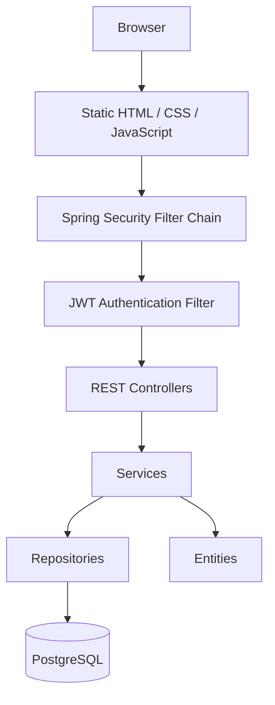

# Stouchi — Personal Budget Tracker

> **Note:** This README is an expanded version of the original project documentation,
covering the application's architecture, authentication flow, security, development workflow,
and future improvements.

## Description

Stouchi is a personal budget management web application that allows users to:

- Register and securely authenticate
- Manage income and expense transactions
- Organize transactions into categories
- Define monthly budgets
- Track balances and spending

The project also serves as a practical learning project for Spring Boot, Spring Security, JWT authentication, Docker, PostgreSQL, and DevOps.


## Original Project

This project is forked from https://github.com/badis99/Projet-AR.git

The original project provided the core budget management features. This fork extends it with Spring Security, JWT authentication, user-specific data isolation, Dockerized PostgreSQL, and DevOps improvements.

---

# Architecture



Authentication happens **before** any controller is executed.

## Functional Areas

- Authentication
- Categories
- Transactions
- Monthly Budget

Entities:

- User
- Category
- Transaction
- MonthlyBudget
- TransactionType

---

# Tech Stack

- Java 17
- Maven
- PostgreSQL 16
- Docker & Docker Compose

Spring Boot:

- Spring Web
- Spring Data JPA
- Spring Security
- JWT Authentication

---

# Running the Application

## Docker

```bash
cp .env.example .env
docker compose up --build
```

Subsequent runs:

```bash
docker compose up
```

Stop:

```bash
docker compose stop
```

Remove containers:

```bash
docker compose down
```

Remove everything including database:

```bash
docker compose down -v
```

---

## Local Development

Run PostgreSQL inside Docker:

```bash
docker compose up postgres
```

Build once (or after dependency changes):
```bash
mvn clean install
```
Start Spring Boot:
```bash
mvn spring-boot:run
```

During development with Spring Boot DevTools, most Java changes only require:
```bash
mvn compile
```
Refresh the browser after DevTools restarts the application. Use `mvn clean install` again only when dependencies change, you need a full build, or want to recreate the JAR.

Advantages:

- Instant restart
- DevTools support
- Easier debugging
- Breakpoints
- No Docker rebuild after every Java change

---

# API Overview

The application exposes two categories of endpoints.

## Authentication Endpoints (`/auth`)

| Method | Endpoint |
|---------|----------|
| POST | /auth/register |
| POST | /auth/login |

These endpoints are accessible without authentication.

---

## Application Endpoints (`/api`)

All endpoints below require a valid JWT.

| Resource | Endpoints |
|----------|-----------|
| Categories | /api/categories |
| Transactions | /api/transactions |
| Budget | /api/budget |

---

# Authentication

Authentication uses JWT.

Workflow:

```text
Register
    ↓
Login
    ↓
JWT generated
    ↓
Browser stores token
    ↓
Future requests include:

Authorization: Bearer <token>
```

The application is **stateless**.

No HTTP session is stored on the server.

---

# Security Filter Chain

Every request follows this path:

```text
HTTP Request
        │
        ▼
Spring Security Filter Chain
        │
        ▼
JwtAuthenticationFilter
        │
        ▼
JWTService
        │
        ▼
SecurityContext
        │
        ▼
Controller
```

The controller never validates the JWT itself.

Instead, Spring Security authenticates the request before any controller executes.

---

# SecurityContext

After validation, the JWT is no longer used directly.

Instead:

- Spring Security creates an authenticated user
- Stores it inside the SecurityContext
- Controllers and services use Spring Security rather than parsing tokens

---

# SecurityConfig

Configuration responsibilities:

- Disable CSRF
- Use stateless sessions
- Permit public pages and static resources:
  - `/register.html`
  - `/login.html`
  - `/index.html`
  - `/js/**`
  - `/css/**`
  - `/auth/register`
  - `/auth/login`
- Register `JwtAuthenticationFilter`
- Protect every other endpoint through:

```java
.anyRequest().authenticated()
```

Every request not explicitly permitted requires a valid JWT before reaching a controller.

---

# User-specific Data

Originally, data was shared.

Now every:

- Category
- Transaction
- MonthlyBudget

belongs to one User through a `user_id`.

Default categories are created after registration instead of application startup.

---

# DTOs

The application exchanges DTOs instead of entities.

Examples:

- RegisterRequest
- LoginRequest
- AuthResponse

Passwords are never returned to clients.

---

# Lombok

Lombok generates:

- Constructors
- Getters
- Setters
- equals()
- hashCode()

keeping entity classes concise.

---

# Static Resources

The browser separately requests:

- HTML
- CSS
- JavaScript
- Images

Therefore Spring Security must permit these resources, otherwise pages load with HTTP 403 or incomplete assets.

---

# Controllers

Controllers expose HTTP endpoints only.

Requests may come from:

- JavaScript
- REST Client
- Postman
- Mobile application

Controllers never know the client.

---

# Frontend Security

Redirects such as

```javascript
window.location.href="/index.html";
```

do **not** protect the application.

Only backend authorization enforced by Spring Security secures protected resources.

---

# HTTP Request Workflow

```text
Browser
   │
JavaScript
   │
fetch()
   │
HTTP Request
   │
Spring Security Filter Chain
   │
JWT Filter
   │
SecurityContext
   │
Controller
   │
Service
   │
Repository
   │
PostgreSQL
   │
JSON Response
   │
JavaScript
   │
DOM Update
```

---

# DevOps Notes

- Multi-stage Docker build
- Layer caching
- PostgreSQL persistent volume
- `.env` secrets
- Hibernate `ddl-auto=update`
- Health checks
- Container dependency ordering
- Tests skipped during Docker image build (`-DskipTests`)

---

# Development Notes

Sometimes after entity or schema changes PostgreSQL may still be initializing while Spring Boot starts.

Restarting the application usually resolves the issue.

---

# Optimization Note

Currently every service retrieves the authenticated user by reading the username from the SecurityContext and querying the database.

This is simple and readable but performs one additional query.

A future optimization would store the fully loaded User inside the Authentication principal during JWT authentication.

---

# Future Improvements

- Change password
- Forgot password
- Refresh tokens
- Delete account
- Better validation
- Better error messages
- Profile page
- GitHub Actions CI
- Cloud deployment
- Terraform
- Monitoring and logging
