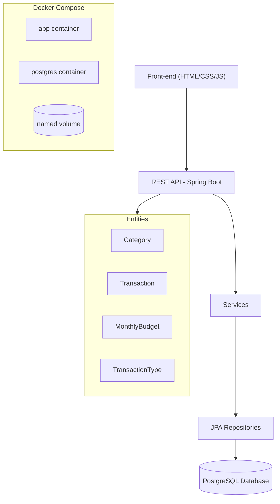

# Stouchi — Personal Budget Tracker

## Description
Stouchi is a personal budget management web app. It lets you record transactions (income and expenses), organize them into categories, and set a monthly budget with balance tracking and alerts.

This project also serves as a hands-on DevOps learning ground — see the [DevOps Notes](#devops-notes) section below for the reasoning behind the infrastructure choices.

## Architecture



- **Layers**: Static UI → REST Controllers → Services → Repositories → Database
- **Modules**: Categories, Transactions, Budget
- **Entities**: `Category`, `Transaction`, `MonthlyBudget`, `TransactionType`
- **Data**: PostgreSQL 16, accessed via Spring Data JPA / Hibernate

## Tech Stack
- Java 17
- Spring Boot (Web, Data JPA)
- PostgreSQL 16
- Maven
- Docker & Docker Compose

## Running the App

### Option 1 — Docker (recommended)

First time, or after changing the Dockerfile, `pom.xml`, or Java source code:
```bash
docker compose up --build
```

Subsequent runs, no code changes:
```bash
docker compose up
```

Copy `.env.example` to `.env` and fill in your own values before running for the first time:
```bash
cp .env.example .env
```

**Troubleshooting:** on first run, the `app` container is sometimes created but not started before Postgres finishes initializing. If `http://localhost:8080` isn't reachable, check container status and start it manually if needed:
```bash
docker ps -a
docker start budget-app
```

**Inspecting the database directly** (in a separate terminal, while containers are running):
```bash
docker exec -it budget-postgres psql -U <POSTGRES_USER> -d <POSTGRES_DB>
```
Useful commands once inside: `\dt` (list tables), `SELECT * FROM categories;`, `\q` (quit).

**Stopping:**
```bash
docker compose stop      # pause, keep containers and data
docker compose down      # remove containers, keep the named volume (data persists)
docker compose down -v   # remove containers AND the named volume (data is wiped)
```

### Option 2 — Local (no Docker)

Requires a running PostgreSQL instance (e.g. a standalone container) matching the credentials in `application.properties`.

```bash
mvn clean install
mvn spring-boot:run
```

## API Overview
Base URL: `http://localhost:8080`

| Resource | Endpoints |
|---|---|
| Categories | `GET /api/categories`, `GET /api/categories/type/{type}`, `POST /api/categories`, `PUT /api/categories/{id}`, `DELETE /api/categories/{id}` |
| Transactions | `GET /api/transactions?month=&year=`, `GET /api/transactions/expenses-by-category`, `POST /api/transactions`, `PUT /api/transactions/{id}`, `DELETE /api/transactions/{id}` |
| Budget | `GET /api/budget/status`, `GET /api/budget`, `POST /api/budget`, `DELETE /api/budget/{id}` |

## DevOps Notes

This section documents the infrastructure decisions made while turning this project into a containerized, database-backed app — mainly for my own learning record, and to make the reasoning visible to anyone reading the repo.

**H2 → PostgreSQL migration.** The original project used H2, an in-memory database — convenient for quick demos, but all data is lost on every restart. Switching to PostgreSQL (running in its own container with a persistent volume) makes the app's data durable, and is a closer match to how a real production setup would look. Thanks to JPA/Hibernate's abstraction, this migration only required changing the JDBC driver dependency in `pom.xml` and the Hibernate dialect in `application.properties` — none of the `@Entity` classes, repositories, or services needed to change.

**`ddl-auto=update` instead of `create-drop`.** The original H2 config used `create-drop`, wiping and recreating all tables on every run — harmless for a throwaway in-memory DB, but destructive for real persisted data. `update` lets Hibernate add missing tables/columns without deleting existing data.

**Secrets via `.env`.** Database credentials are no longer hardcoded in `docker-compose.yml`. They live in a local `.env` file (excluded from git via `.gitignore`, and from the Docker build context via `.dockerignore`), referenced as `${POSTGRES_USER}` etc. A `.env.example` file documents the expected variables with placeholder values for anyone setting up the project.

**Multi-stage Docker build.** The `Dockerfile` uses two separate stages: the first (`maven:3.9-eclipse-temurin-17`) compiles the app and produces a `.jar`; the second (`eclipse-temurin:17-jre`) starts from a much smaller image containing only a JRE, and copies in just the compiled `.jar` from the first stage. Everything else from the build stage (Maven, the JDK, raw source code) is discarded — it never exists in the final image. This keeps the runtime image small and reduces its attack surface.

**Layer caching.** The `Dockerfile` copies `pom.xml` and resolves dependencies *before* copying the source code. Since Docker caches each instruction as a layer, this means dependency downloads are only re-run when `pom.xml` actually changes — editing Java source code alone reuses the cached dependency layer, making rebuilds much faster.

**Tests are skipped during the image build** (`-DskipTests`). The assumption is that tests are run as their own separate step (e.g. in a CI pipeline), before the image is even built — running them again during every image build would be redundant and would slow down the build unnecessarily.

**Healthcheck + `depends_on: condition: service_healthy`.** The `app` container waits for Postgres to report itself as actually ready to accept connections (not just "started"), avoiding race-condition connection failures on first boot.

**Named volume (`postgres-data`).** Without it, removing the Postgres container would permanently delete all data — containers are ephemeral by design. The named volume persists independently of the container's lifecycle, so data survives `docker compose down` (though not `docker compose down -v`, which explicitly removes volumes too).

## Roadmap
- [x] Dockerize app + PostgreSQL (Docker Compose, persistent volume, secrets via `.env`)
- [ ] Add authentication (login/signup)
- [ ] CI pipeline (GitHub Actions): lint, test, build image
- [ ] CD to a cloud VM
- [ ] Infrastructure as Code (Terraform)
- [ ] Move to managed cloud services (RDS, ECS/EKS)
- [ ] Observability (metrics, logs, alerts)