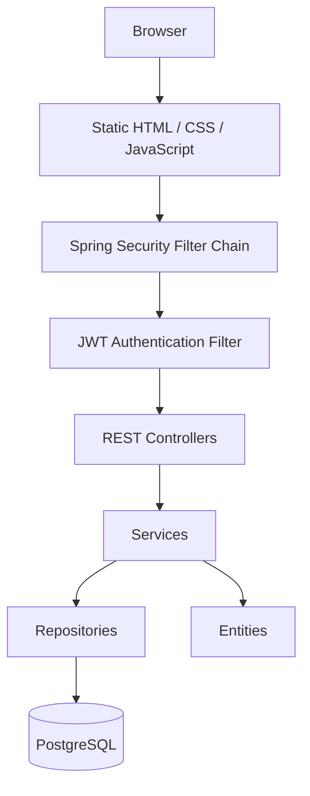

# Stouchi — Personal Budget Tracker

> **Note:** This README is an expanded version of the original project documentation,
covering the application's architecture, authentication flow, security, development workflow,
and future improvements.

## Description

Stouchi is a personal budget management web application that allows users to:

- Register and securely authenticate
- Manage income and expense transactions
- Organize transactions into categories
- Define monthly budgets
- Track balances and spending

The project also serves as a practical learning project for Spring Boot, Spring Security, JWT authentication, Docker, PostgreSQL, and DevOps.


## Original Project

This project is forked from https://github.com/badis99/Projet-AR.git

The original project provided the core budget management features. This fork extends it with Spring Security, JWT authentication, user-specific data isolation, Dockerized PostgreSQL, and DevOps improvements.

---

# Architecture



Authentication happens **before** any controller is executed.

## Functional Areas

- Authentication
- Categories
- Transactions
- Monthly Budget

Entities:

- User
- Category
- Transaction
- MonthlyType
- TransactionType

---

# Tech Stack

- Java 17
- Maven
- PostgreSQL 16
- Docker & Docker Compose

Spring Boot:

- Spring Web
- Spring Data JPA
- Spring Security
- JWT Authentication

---

# Running the Application

## Docker

```bash
cp .env.example .env
docker compose up --build
```

Subsequent runs:

```bash
docker compose up
```

Stop:

```bash
docker compose stop
```

Remove containers:

```bash
docker compose down
```

Remove everything including database:

```bash
docker compose down -v
```

---

## Local Development

Run PostgreSQL inside Docker:

```bash
docker compose up postgres
```

Build once (or after dependency changes):
```bash
mvn clean install
```
Start Spring Boot:
```bash
mvn spring-boot:run
```

During development with Spring Boot DevTools, most Java changes only require:
```bash
mvn compile
```
Refresh the browser after DevTools restarts the application. Use `mvn clean install` again only when dependencies change, you need a full build, or want to recreate the JAR.

Advantages:

- Instant restart
- DevTools support
- Easier debugging
- Breakpoints
- No Docker rebuild after every Java change

---

# API Overview

The application exposes two categories of endpoints.

## Authentication Endpoints (`/auth`)

| Method | Endpoint |
|---------|----------|
| POST | /auth/register |
| POST | /auth/login |

These endpoints are accessible without authentication.

---

## Application Endpoints (`/api`)

All endpoints below require a valid JWT.

| Resource | Endpoints |
|----------|-----------|
| Categories | /api/categories |
| Transactions | /api/transactions |
| Budget | /api/budget |

---

# Authentication

Authentication uses JWT.

Workflow:

```text
Register
    ↓
Login
    ↓
JWT generated
    ↓
Browser stores token
    ↓
Future requests include:

Authorization: Bearer <token>
```

The application is **stateless**.

No HTTP session is stored on the server.

---

# Security Filter Chain

Every request follows this path:

```text
HTTP Request
        │
        ▼
Spring Security Filter Chain
        │
        ▼
JwtAuthenticationFilter
        │
        ▼
JWTService
        │
        ▼
SecurityContext
        │
        ▼
Controller
```

The controller never validates the JWT itself.

Instead, Spring Security authenticates the request before any controller executes.

---

# SecurityContext

After validation, the JWT is no longer used directly.

Instead:

- Spring Security creates an authenticated user
- Stores it inside the SecurityContext
- Controllers and services use Spring Security rather than parsing tokens

---

# SecurityConfig

Configuration responsibilities:

- Disable CSRF
- Use stateless sessions
- Permit public pages and static resources:
  - `/register.html`
  - `/login.html`
  - `/index.html`
  - `/js/**`
  - `/css/**`
  - `/auth/register`
  - `/auth/login`
- Register `JwtAuthenticationFilter`
- Protect every other endpoint through:

```java
.anyRequest().authenticated()
```

Every request not explicitly permitted requires a valid JWT before reaching a controller.

---

# User-specific Data

Originally, data was shared.

Now every:

- Category
- Transaction
- MonthlyBudget

belongs to one User through a `user_id`.

Default categories are created after registration instead of application startup.

---

# DTOs

The application exchanges DTOs instead of entities.

Examples:

- RegisterRequest
- LoginRequest
- AuthResponse

Passwords are never returned to clients.

---

# Lombok

Lombok generates:

- Constructors
- Getters
- Setters
- equals()
- hashCode()

keeping entity classes concise.

---

# Static Resources

The browser separately requests:

- HTML
- CSS
- JavaScript
- Images

Therefore Spring Security must permit these resources, otherwise pages load with HTTP 403 or incomplete assets.

---

# Controllers

Controllers expose HTTP endpoints only.

Requests may come from:

- JavaScript
- REST Client
- Postman
- Mobile application

Controllers never know the client.

---

# Frontend Security

Redirects such as

```javascript
window.location.href="/index.html";
```

do **not** protect the application.

Only backend authorization enforced by Spring Security secures protected resources.

---

# HTTP Request Workflow

```text
Browser
   │
JavaScript
   │
fetch()
   │
HTTP Request
   │
Spring Security Filter Chain
   │
JWT Filter
   │
SecurityContext
   │
Controller
   │
Service
   │
Repository
   │
PostgreSQL
   │
JSON Response
   │
JavaScript
   │
DOM Update
```

---

# DevOps Notes

- Multi-stage Docker build
- Layer caching
- PostgreSQL persistent volume
- `.env` secrets
- Hibernate `ddl-auto=update`
- Health checks
- Container dependency ordering
- Tests skipped during Docker image build (`-DskipTests`)

---

# Testing

## Overview

In a DevOps CI/CD pipeline, automated tests serve as a critical quality gate before deployment. They catch regressions early and ensure code reliability. This project includes both unit tests and integration tests to validate business logic and full application workflows.

The project tests live under `./src/test/java/com/budgettracker`.

### Test Types in This Project

This project uses two main testing approaches:

**Unit Tests:**
- `BudgetServiceTest.java` — validates budget status calculations for scenarios like no budget, below-limit usage, reaching 100%, and exceeding the budget
- `UserServiceTest.java` — validates login behavior for invalid username, wrong password, and successful authentication

**Integration Tests:**
- `AuthenticationIntegrationTest.java` — exercises the real authentication flow with MockMvc, Spring Boot, and Testcontainers against a PostgreSQL test container

---

## Security Debug Logging

If you want better visibility while debugging security-related issues, enable:

```properties
logging.level.org.springframework.security=DEBUG
```

in `src/main/resources/application.properties`.

This helps you see:

- Which security filter is processing the request
- Whether authentication succeeded or failed
- Which URL matcher was applied
- Why a request was rejected
- Whether you received 401 or 403

---

## Error Handling and Protected `/error` Endpoint

If the `/error` page is protected, a confusing situation can occur:

**Original error:**

```
500 Internal Server Error
```

**What you see instead:**

```
403 Forbidden
```

because Spring Security blocked the error page before the real error could be displayed.

A common fix is to allow it explicitly in `SecurityConfig`:

```java
.requestMatchers("/error").permitAll()
```

This prevents Spring Security from hiding the real root cause behind a security block, making debugging much easier.

---

## Test Structure: Arrange, Act, Assert

Both unit tests and integration tests follow the same logical structure:

**Unit Test Example:**

```
Arrange: create mocks, set up when(...).thenReturn(...)
   ↓
Act: call the method under test
   ↓
Assert: verify result using assertEquals(), assertTrue(), assertThrow()
```

**Integration Test Example:**

```
Arrange: prepare test data using repositories/services (NOT HTTP requests)
   ↓
Act: perform HTTP request via MockMvc
   ↓
Assert: verify HTTP status, response body, and database state
```

For integration test example:

```java
@Test
void shouldNotRegisterDuplicateUser() throws Exception
{
    // Arrange: create and persist test data via repository
    User existingUser = new User();
    existingUser.setUsername("anais");
    userRepository.save(existingUser);

    String requestBody = """
    {
        "name": "Anais",
        "lastname": "Watterson",
        "username": "anais",
        "password": "meaw123"
    }
    """;

    // Act: perform HTTP request
    ResultActions res = mockMvc.perform(post("/auth/register")
        .contentType(MediaType.APPLICATION_JSON)
        .content(requestBody));

    // Assert: verify response and database state
    res.andExpect(status().isConflict());
    res.andExpect(content().string("Username already exists"));
    assertEquals(1, userRepository.count());
}
```

### Test Naming Convention

Use a descriptive naming style:

```
methodName_condition_expectedResult
```

Example:

```java
void getBudgetStatus_whenNoBudgetExists_returnsStatusWithoutBudget()
```

This makes test purpose immediately clear.

---

## Test Isolation

Each test describes one scenario and runs independently. Test isolation is critical for both unit and integration tests.

**Unit Tests:** Create fresh mock objects for every test method. If the "warning" test fails, you know it failed because of the warning logic, not because another test changed the mock behavior.

**Integration Tests:** Each test must independently prepare its own data using repository operations in `@BeforeEach` setup. JUnit does not guarantee execution order, so dependencies between tests create brittleness. Instead, each test independently sets up the data it needs via the repository.

---

## Unit Testing

### Unit Test Assertions

Unit tests verify behavior using standard JUnit assertions:

```java
assertEquals(expected, actual)      // Check values match
assertTrue(condition)                // Check boolean is true
assertFalse(condition)               // Check boolean is false
assertThrow(Exception.class, () -> { // Check exception is thrown
    methodThatShouldFail();
});
```

### Understanding Mockito

In unit tests, we use Mockito to validate method logic in isolation without a database.

You could manually write a fake repository class, but Mockito dynamically generates fake implementations of interfaces at test runtime:

```java
UserRepository fakeRepo = Mockito.mock(UserRepository.class);
```

Mockito creates an object that satisfies the interface but does nothing by default unless you explicitly configure it. The fake is created inline inside your test method using Mockito's API—you never write a generated class file yourself.

### Mockito: Two Core Jobs

Mockito performs two distinct jobs:

**Job 1: Stubbing** — Teaching the mock what to return

```java
when(userRepository.findByUsername("anais"))
    .thenReturn(Optional.empty());
```

This answers: "If this method is called, what should it return?"

**Job 2: Verification** — Checking if a method was actually invoked

```java
verify(userRepository).findByUsername("anais");
```

or with argument matchers:

```java
verify(fakePasswordEncoder, never())
    .matches(anyString(), anyString());
```

This asks: "Did this method actually get called with these arguments?"

Mockito maintains an internal record of every method call on every mock, so you can inspect the interaction history after the test completes.

### State-Based vs Interaction-Based Testing

There are two broad styles of unit testing:

**State-Based Testing** — Verify the returned result

```java
Map<String, Object> status = getBudgetStatus(...);
assertEquals(800.0, status.get("balance"));
```

Question: "After the method finished, is the returned state correct?"

**Interaction-Based Testing** — Verify how the object communicated with collaborators

```java
login("user", "password");
verify(userRepository).findByUsername("user");
verify(passwordEncoder).matches(anyString(), anyString());
verify(jwtGenerator).generateToken(any(User.class));
```

Questions:
- Did it ask the repository for the user?
- Did it validate the password?
- Did it generate a JWT?

Most tests blend both approaches: verify the response (state) and confirm expected method calls (interaction).

### Why CurrentUserService was Introduced

Before the refactoring, multiple services duplicated logic to retrieve the authenticated user:

```
BudgetService
    └── getCurrentUser()

TransactionService
    └── getCurrentUser()

CategoryService
    └── getCurrentUser()
```

This created coupling and violated the Single Responsibility Principle. Business services were tightly coupled to authentication mechanics (JWT, SecurityContext, session handling). Changes to user retrieval logic would require modifications across three locations, increasing maintenance risk.

The solution was to create `CurrentUserService.java` with a single, focused responsibility:

```
CurrentUserService
    ├── SecurityContextHolder
    └── UserRepository
```

This separation enables:
- Simplified unit tests without mocking SecurityContext
- Eliminated duplicated authentication logic
- Cleaner service design aligned with single responsibility principle

### Unit Test Example: BudgetService

The class under test is `BudgetService` with the method `getBudgetStatus(int month, int year)`.

BudgetService depends on:

```java
private final MonthlyBudgetRepository budgetRepository;
private final TransactionService transactionService;
private final CurrentUserService currentUserService;
```

In a unit test, we create a **real** BudgetService but inject **mocked** dependencies:

```
            TEST
             │
             ▼
      Real BudgetService
             │
    ┌────────┼────────────────┐
    │        │                │
  Mock     Mock              Mock
  BudgetRepo  Transaction  CurrentUser
             Service        Service
```

The test creates the class manually—it does **not** ask Spring to create it:

```java
BudgetService budgetService = new BudgetService(
    fakeBudgetRepository,
    fakeTransactionService,
    fakeCurrentUserService
);
```

Why not use Spring (`@SpringBootTest` + `@Autowired`)?

Because starting Spring creates an entire application context:

```
Spring Boot
   ├── repositories
   ├── security
   ├── database config
   ├── beans
   └── ...
```

This makes the test slower and turns it into an integration test. For unit tests, we want **fast isolation**, not the full application stack.

### Testing Style and General Rules

The main rule:

- **Simple objects** (DTOs, entities) → create real objects
- **Services, repositories, external systems** → mock

This keeps tests focused, fast, and readable.

---

## Integration Testing

### Overview

Integration tests verify that the real application stack works together: Spring dependency injection, Spring Security, JPA repositories, PostgreSQL, and your actual configuration.

Key difference from unit tests: In unit tests you deliberately bypass Spring for speed and isolation. In integration tests, you want Spring involved.

```
MockMvc
   │
   ▼
Spring Boot
   │
   ▼
Database
   │
   ▼
Security
   │
   ▼
Repositories
   │
   ▼
Services
   │
   ▼
AuthController
```

### Testcontainers and PostgreSQL

Integration tests use **Testcontainers** to run a real PostgreSQL container:

```
Test execution
   │
   ├── JUnit orchestrates
   ├── Spring Test starts application context
   ├── Testcontainers starts PostgreSQL
   │
   ▼
POST /auth/register
   │
   ▼
AuthController
   │
   ▼
UserService
   │
   ▼
PostgreSQL container
```

Benefits:

- Tests run against a real database, not mocks
- PostgreSQL is isolated to the test—no side effects on your dev database
- Container is created once per test class (`@ServiceConnection`), improving speed

### MockMvc: Simulating HTTP Requests

MockMvc acts as a fake browser/Postman that sends HTTP requests directly to your Spring application without network overhead:

```
MockMvc
   │
   ▼
DispatcherServlet
   │
   ▼
Controller
   │
   ▼
Service
   │
   ▼
Repository
   │
   ▼
PostgreSQL container
```

Why MockMvc instead of a real server?

If you started Tomcat for every test, you'd wait for server startup and shutdown. MockMvc skips the networking part and runs everything in the same JVM, making tests much faster.

The builder pattern (fluent API) chains method calls:

```java
mockMvc.perform(
    post("/auth/register")
        .contentType(MediaType.APPLICATION_JSON)
        .content(requestBody)
)
.andExpect(status().isCreated())
.andExpect(jsonPath("$.username").value("anais"));
```

### Test Configuration: application-test.properties

Integration tests use a separate configuration file at `src/main/resources/application-test.properties` that differs from production settings:

```properties
spring.jpa.database-platform=org.hibernate.dialect.PostgreSQLDialect
# Every test run starts clean (unlike dev which uses 'update')
spring.jpa.hibernate.ddl-auto=create-drop
```
Testcontainers manage port, username, password...

The `create-drop` setting ensures:
- Database schema is recreated before each test class
- Tables are dropped after all tests complete
- Each test class starts with a pristine schema

This is configured via `@ActiveProfiles("test")` on the test class.

### Static PostgreSQL Container

To avoid starting a new PostgreSQL container for every test method, define the container as a static field in the test class:

```java
@SpringBootTest
@AutoConfigureMockMvc
@Testcontainers
@ActiveProfiles("test")
class AuthenticationIntegrationTest 
{
    ///////

    @Container
    @ServiceConnection
    private static final PostgreSQLContainer<?> postgres = new PostgreSQLContainer<>("postgres:16");

    @BeforeEach
    void cleanDatabase()
    {
        userRepository.deleteAll();
    }
```

Benefits:
- Container starts once per test class
- All test methods in the class share it
- Faster execution than per-method containers

### @ServiceConnection vs @DynamicPropertySource

**Recommended Approach: @ServiceConnection**

```java
@ServiceConnection
static PostgreSQLContainer<?> postgres = new PostgreSQLContainer<>("postgres:16");
```

This is cleaner than `@DynamicPropertySource` because:
- Spring automatically configures connection details (URL, username, password)
- Less boilerplate code
- Testcontainers handles port binding transparently

### AuthenticationIntegrationTest: What It Covers

`AuthenticationIntegrationTest` uses:

- `@SpringBootTest` to boot the full application context
- `MockMvc` to send real HTTP requests
- `Testcontainers` to start PostgreSQL in a test container via `@ServiceConnection`
- `@ActiveProfiles("test")` to use test configuration (`application-test.properties`)
- `UserRepository` to inspect database state after requests

The test verifies:

- HTTP response status (e.g., 201 Created, 400 Bad Request, 409 Conflict)
- Returned JSON body contains expected fields
- User data is persisted correctly in PostgreSQL
- Passwords are hashed (not stored in plaintext)

Note: When writing these integration tests, you are not trying to prove that BCrypt works. Spring Security already has tests for that. Instead, you verify that your application correctly uses the password encoder and stores the result.

### Field Injection vs Constructor Injection in Integration Tests

Field injection via `@Autowired` is acceptable in test classes:

```java
@Autowired
UserRepository userRepository;

@Autowired
MockMvc mockMvc;
```

Why it's fine:

- Test classes are never instantiated manually or reused elsewhere
- JUnit and Spring always create the test instance
- There is no risk of accidental manual construction: `new AuthIntegrationTest()`
- Test classes are not part of your application architecture—they're utilities used exclusively by JUnit

Constructor injection (which some prefer for production code) would add unnecessary complexity to test classes.

### Database Cleanup and Foreign Key Constraints

When using `userRepository.deleteAll()` in `@BeforeEach`, ensure cascade is properly configured:

```java
// In Transaction entity for example
@ManyToOne(fetch = FetchType.LAZY)
@JoinColumn(name = "user_id", nullable = false, foreignKey = @ForeignKey(
        foreignKeyDefinition = "FOREIGN KEY (user_id) REFERENCES users(id) ON DELETE CASCADE"))
private User user;
```

If cascade is not configured, `deleteAll()` will fail with:

```
DataIntegrityViolationException: ERROR: update or delete on table "users"
violates foreign key constraint...
```

This occurs because Transaction, MonthlyBudget, and Category entities have foreign keys pointing to the users table.

### Cleaning the Database Between Tests

Option 1: **Transactional Rollback** — Spring can run each test inside a transaction and roll it back afterward:

```java
@Transactional
class AuthIntegrationTest { ... }
```

Caveat: With async behavior or real HTTP requests, rollback timing can become unclear. Not recommended for integration tests.

Option 2: **Manual Cleanup** — Delete data before each test:

```java
@BeforeEach
void setUp() {
    userRepository.deleteAll();  // Requires CASCADE configuration
}
```

Simple, explicit, and predictable.

Option 3: **Testcontainers Lifecycle** — With `@ServiceConnection`, one PostgreSQL container is created per test class:

```
Start PostgreSQL container
   │
   ▼
Run all tests in AuthIntegrationTest
   │
   ▼
Destroy container
```

Isolation: Tests in `AuthIntegrationTest` don't affect other integration test classes.
Speed: You avoid paying the cost of starting PostgreSQL for every test method.

---

## Running Tests

### All Tests

From the project root:

```bash
mvn test
```

or with a full lifecycle cleanup:

```bash
mvn clean test
```

This lifecycle:

```
1. clean: delete target/ directory
   ↓
2. compile main code
   ↓
3. compile test code
   ↓
4. run tests (stops here)
```

It does **not** create a JAR or install anything in your local Maven repository.

### Specific Test

Run one specific test class or method:

```bash
mvn -Dtest=ClassName test
```

or one specific method:

```bash
mvn -Dtest=ClassName#methodName test
```

Example:

```bash
mvn -Dtest=BudgetServiceTest test
mvn -Dtest=UserServiceTest#login_shouldFailWithWrongPassword test
```

### What mvn clean test Does

```
clean
  │
  ▼
delete target/ directory
  │
  ▼
compile main code
  │
  ▼
compile test code
  │
  ▼
run tests (finds classes ending with: Test, Tests, TestCase)
  │
  ▼
stops (no JAR, no repository install)
```

---

## HTTP Status and Exception Handling in AuthController

To provide accurate HTTP responses and meaningful error messages to integration tests and clients, exceptions are explicitly handled in `AuthController`.

This explicit handling ensures:
- Integration tests receive accurate HTTP status codes (409 Conflict, 401 Unauthorized, etc.)
- Error response bodies are consistent and meaningful
- Testing frameworks can verify both status and message content

---

# Optimization Note

Currently every service retrieves the authenticated user by reading the username from the SecurityContext and querying the database.

This is simple and readable but performs one additional query.

A future optimization would store the fully loaded User inside the Authentication principal during JWT authentication, eliminating the extra database query.

---

# Future Improvements

- Change password
- Forgot password
- Refresh tokens
- Delete account
- Better validation
- Better error messages
- Profile page
- GitHub Actions CI
- Cloud deployment
- Terraform
- Monitoring and logging
- Authenticated endpoint integration tests (Authorization: Bearer ...)
- Expired JWT and invalid JWT tests
- Budget/transaction integration tests
- Category CRUD integration tests
- End-to-End (E2E) tests
- Performance tests
- Security tests
- Introduce Flyway database migrations (`src/main/resources/db/migration/`)