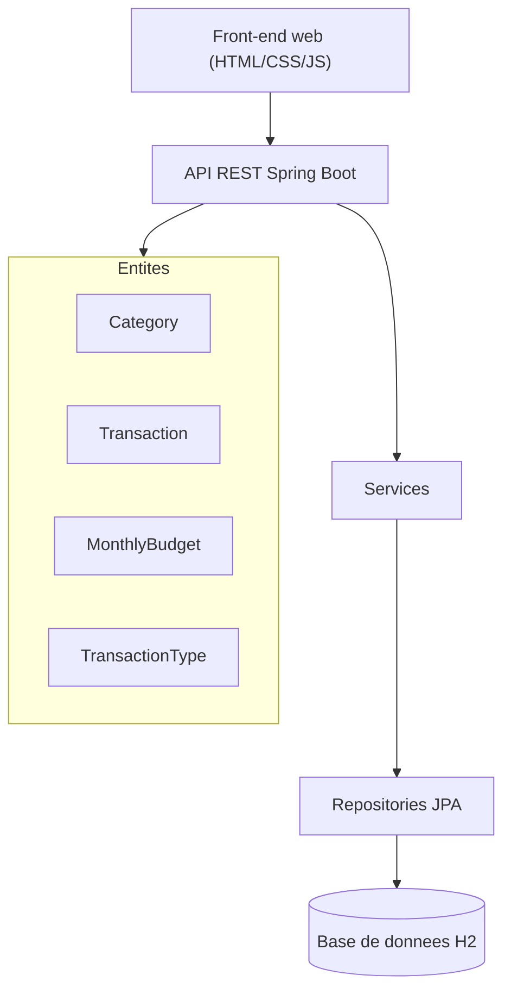

# Stouchi — Suivi de budget

## Description courte
Stouchi est une application web de gestion de budget personnel. Elle permet d'enregistrer des transactions (revenus et dépenses), d'organiser des catégories et de définir un budget mensuel avec un suivi des soldes et alertes.

## Architecture (couches, modules, entités, données)

- **Couches** : UI statique → Contrôleurs REST → Services → Repositories → Base de données.
- **Modules** : Categories, Transactions, Budget.
- **Entités** : Category, Transaction, MonthlyBudget, TransactionType.
- **Données** : H2 en mémoire (via Spring Data JPA).

## Endpoints exposes
Base URL : `http://localhost:8080`

### Categories
- `GET /api/categories`
- `GET /api/categories/type/{type}`
- `POST /api/categories`
	- Corps JSON : `{ "name": "Courses", "type": "EXPENSE", "color": "#ff6b6b" }`
- `PUT /api/categories/{id}`
	- Corps JSON : `{ "name": "Courses", "type": "EXPENSE", "color": "#ff6b6b" }`
- `DELETE /api/categories/{id}`

### Transactions
- `GET /api/transactions?month=5&year=2026`
- `GET /api/transactions?month=5&year=2026&type=INCOME`
- `GET /api/transactions/expenses-by-category?month=5&year=2026`
- `POST /api/transactions`
	- Corps JSON : `{ "description": "Salaire", "amount": 2500, "type": "INCOME", "date": "2026-05-02", "note": "", "category": { "id": 1 } }`
- `PUT /api/transactions/{id}`
	- Corps JSON : `{ "description": "Salaire", "amount": 2600, "type": "INCOME", "date": "2026-05-02", "note": "", "category": { "id": 1 } }`
- `DELETE /api/transactions/{id}`

### Budget
- `GET /api/budget/status?month=5&year=2026`
- `GET /api/budget?month=5&year=2026`
- `POST /api/budget`
	- Corps JSON : `{ "month": 5, "year": 2026, "budgetLimit": 2000 }`
- `DELETE /api/budget/{id}`
